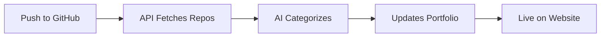

# Nipun Sujesh - AI & Data Science Portfolio

<div align="center">


[](https://www.nipun.space)
[](LICENSE)

**🌟 A cutting-edge portfolio featuring 3D animations, AI chatbot, and automatic GitHub integration 🌟**

</div>

> 💡 **Why this portfolio stands out:** Real-time GitHub sync • AI-powered chat assistant • 3D solar system navigation • Zero maintenance required

## 📊 GitHub Stats

<div align="center">


</div>

## ✨ What Makes This Special?

### 🤖 **Automatic GitHub Integration**
```diff
+ Live Repository Sync - Push to GitHub, see it on your portfolio instantly
+ Smart AI Categorization - Automatically sorts projects by type
+ Zero Manual Updates - Set it once, forget it forever
```

### 🎨 **Immersive 3D Experience**
- 🪐 **Solar System Navigation** - Navigate through pages via interactive planets
- ✨ **Smooth Animations** - Framer Motion powered transitions
- 🌌 **Three.js Graphics** - Professional 3D visualizations

### 💬 **AI-Powered Chat Assistant**
- 🧠 Powered by **Google Gemini AI**
- 💡 Answers questions about projects, skills, and experience
- ⚡ Real-time responses with conversation memory

### 📝 **Rich Content**
- 📊 **5 Technical Blog Posts** - Real AI/ML learning experiences
- 🏆 **Certifications Showcase** - IBM AI Developer & more
- 📞 **Interactive Contact Form** - Direct communication channel

## 🛠️ Tech Stack

<div align="center">

| Frontend | APIs & Integration | Styling & Animation |
|----------|-------------------|---------------------|
| ⚛️ React 19 | 🐙 GitHub API | 🎨 Tailwind CSS |
| ⚡ Vite | 🤖 Google Gemini AI | 🎭 Framer Motion |
| 🧭 React Router | 🔥 Firebase | 🌌 Three.js |

</div>

## 📱 Portfolio Highlights

<table>
<tr>
<td width="50%">

### 🎯 Core Features
- 🏠 **3D Solar System Home**
- 👨💻 **About Me** (8.0 CGPA, 2026)
- 🧠 **Skills Showcase**
- 🚀 **Live GitHub Projects**

</td>
<td width="50%">

### 📝 Content
- 📊 **Auto-Synced Repos**
- ✍️ **5 Technical Blogs**
- 🏆 **Certifications**
- 💬 **AI Chatbot**

</td>
</tr>
</table>

## 🤖 How GitHub Auto-Sync Works



**Smart Categorization:**
- 🧠 **AI/ML** → Python + AI keywords
- 🌐 **Web Dev** → JavaScript/React/HTML
- 📊 **Data Science** → Analysis & visualization
- 📱 **Mobile** → Android/iOS/React Native
- 🔧 **Mini Projects** → Learning repos

## 🎓 About Me

<div align="center">

**🎯 BTech AI & Data Science | Final Year 2026 | 8.0 CGPA**

</div>

| 🎯 Focus | 🏆 Achievements | 🔬 Current Work |
|---------|----------------|----------------|
| Machine Learning | IBM AI Developer Certified | Mental Health AI Project |
| Deep Learning | Azure AI Experience | Full-Stack Development |
| Data Analytics | 5 Published Blogs | Open Source Contributor |

## 🚀 Quick Start

```bash
# 1️⃣ Clone
git clone https://github.com/Luc0-0/Nipun-portfolio.git

# 2️⃣ Install
cd Nipun-portfolio && npm install

# 3️⃣ Run
npm run dev

# 🎉 Open http://localhost:5173
```

<details>
<summary>📦 Production Build</summary>

```bash
npm run build && npm run preview
```
</details>

## ⚙️ Configuration

<details>
<summary>🐙 GitHub Integration</summary>

**File:** `src/utils/githubApi.js`
```javascript
const GITHUB_USERNAME = "your-username"; // Change this
```
</details>

<details>
<summary>🤖 AI Chatbot Setup</summary>

1. Create `.env` file:
```bash
VITE_GEMINI_API_KEY=your_api_key
```

2. Get API key: [Google AI Studio](https://makersuite.google.com/app/apikey)

3. Restart dev server
</details>

## 📊 Performance

- ⚡ **Lighthouse Score:** 95+
- 🚀 **Load Time:** < 2s
- 📱 **Mobile Optimized:** 100%
- ♿ **Accessibility:** WCAG 2.1 AA

## 📄 License

MIT License - feel free to use this for your own portfolio! 🎉

## 📈 Project Stats


## 🤝 Connect

<div align="center">

[](mailto:nipunsujesh28@gmail.com)
[](https://linkedin.com/in/nipun-sujesh)
[](https://github.com/Luc0-0)
[](https://www.nipun.space)

</div>

---

<div align="center">

### ⭐ Star this repository if you found it helpful!

**Built with ❤️ by Nipun Sujesh**

_Showcasing the future of AI and Data Science_


</div>
