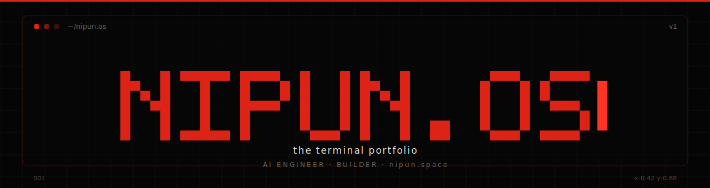
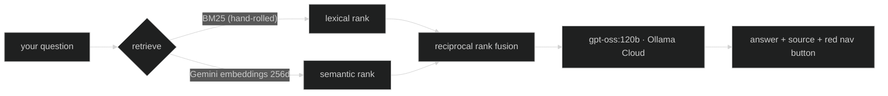

<div align="center">
  
</div>

<div align="center">

&nbsp;


**a portfolio that boots.** black screen, one red, a command bar at the bottom. everything else grew out of that.

live at **[nipun.space](https://nipun.space)**

</div>


## &gt; boot

```console
$ ssh nipun@nipun.space
[ ok ]  booting nipun.os ...
[ ok ]  command bar online
[ ok ]  lucbot daemon ready

$ whoami
nipun sujesh : AI engineer, final-year B.E. (AI & Data Science)
building Uni-Verse, automating workflows @ impress.ai

$ help
  /            open the command palette (go anywhere, or ask LucBot)
  scroll wheel spin the vertical page wheel on the home screen
  ask ...      type a question, LucBot answers from real site data
```

Built by [Nipun Sujesh](https://linkedin.com/in/nipun-sujesh).


## &gt; what is this

Most portfolios are a hero, three cards, a footer. This one is a terminal you actually drive.

- **The command bar is the whole navigation.** Hit `/` or click the bar, the palette opens, every page is a command. No navbar, no hamburger. Everything else was built around it.
- **A 3D scroll wheel** on the home screen: page names curve through a rotating cylinder, scroll to spin it, click to go. Infinite loop, home-only.
- **It boots.** A short init sequence on first load, then the pixel wordmark assembles itself.
- **A point-cloud portrait**, reconstructed from thousands of particles, single red accent on the screen glow.
- **Every sound is synthesized** in the Web Audio API. Zero audio files in the repo.
- **One color.** `#dd2316`. Used with restraint, never decoration.


## &gt; LucBot

The daemon that lives in the command bar. Type a question instead of a command and it answers, about me, from the site's own content. It refuses to make things up.


```mermaid
%%{init: {'theme':'dark'}}%%
flowchart LR
  Q["your question"] --> R{"retrieve"}
  R -->|"BM25 (hand-rolled)"| L["lexical rank"]
  R -->|"Gemini embeddings 256d"| S["semantic rank"]
  L --> F["reciprocal rank fusion"]
  S --> F
  F --> G["gpt-oss:120b · Ollama Cloud"]
  G --> A["answer + source + red nav button"]
```

- **Hybrid retrieval.** A BM25 scorer written from scratch in ~40 lines of browser JS, plus Gemini embeddings truncated to 256 dims, merged with reciprocal rank fusion. 91 chunks, rebuilt from the site's real data files on every deploy.
- **Page-aware.** Ask "what is this project" while standing on a project page and it knows where you are.
- **Judgment mode.** Comparative questions ("best project?") pull the whole catalog, so the model reasons across everything, then commits to an opinion it can justify.
- **Function calling.** When a page answers better than prose, LucBot offers a red button. It suggests, you click. It never navigates on its own.
- **Honest by construction.** Answers come only from retrieved context. Off-data questions get a plain "not loaded into my memory."
- **Transport.** A Vercel function speaking the HTTP QUERY method (RFC 10008) with POST fallback, streaming from gpt-oss on Ollama Cloud. Keys never touch the browser.

Validated by a golden-set eval that caught three real bugs before launch: a missing stopword, missing plural stemming, and a route boost that multiplied zero instead of adding to it.


## &gt; the pages

| route | what happens there |
|---|---|
| `/` | boot sequence, pixel wordmark, particle point-cloud portrait, live telemetry, the 3D nav wheel |
| `/work` | infinite project strip; each project opens as a file-view doc with interactive diagrams |
| `/about` | a system monitor of a person: ASCII fluid that reacts to typing, htop-style telemetry, a draggable mind map, a boot-log timeline |
| `/skills` | one radar, 26 skills, 6 sectors, click a sector to filter |
| `/services` | web, AI apps, RAG chatbots; a 3D ring of theme concepts; briefs land straight in my inbox |
| `/writing` | notes from building: memory systems, agents, production RAG, MCP |
| `/achievements` | certs and wins, expandable to the actual certificates |
| `/opensource` | GodProfile (an MCP server) and learning notebooks |
| `/contact` | compose to my inbox, no middleman |
| `/map` | the whole site drawn as its own engineering blueprint, LucBot wired in as a daemon on the bus |


## &gt; stack

```text
frontend   React 19 · Vite · Tailwind · Framer Motion · Three.js
ai         gpt-oss:120b (Ollama Cloud) · Gemini embeddings · hand-rolled BM25 + RRF
backend    Vercel serverless functions (keys server-side) · Upstash Redis
sound      Web Audio API, fully synthesized
design     one red #dd2316 · JetBrains Mono · Inter small-caps · Jersey pixel
```


## &gt; run it locally

```bash
git clone https://github.com/Luc0-0/Nipun-portfolio.git
cd Nipun-portfolio && npm install
```

```bash
# .env
OLLAMA_API_KEY=...        # LucBot answers (chat)
GEMINI_API_KEY=...        # embeddings for retrieval
OLLAMA_MODEL=gpt-oss:120b
VITE_WEB3FORMS_KEY=...    # contact + brief forms
```

```bash
node scripts/dev-api.mjs   # terminal 1: LucBot API
npm run dev                # terminal 2: the site
```

Missing keys degrade gracefully. No Gemini key and retrieval falls back to pure BM25; the site still runs.


## &gt; structure

```text
src/
├─ components/terminal/
│  ├─ CommandBar.jsx      # the / palette + LucBot input
│  ├─ VerticalNav.jsx     # the 3D infinite page wheel (home)
│  ├─ TerminalHero.jsx    # boot, wordmark, portrait, telemetry
│  ├─ OnboardingDemo.jsx  # first-run guided tour
│  ├─ ScrollProgress.jsx  # global scroll indicator
│  ├─ rag.js              # hybrid retrieval (BM25 + embeddings + RRF)
│  └─ sound.js            # synthesized Web Audio
├─ pages/                 # about, skills, services, writing, ...
└─ data/                  # ground-truth facts, chunked at build time
api/                      # Vercel functions (ask, proxies)
scripts/build-chunks.mjs  # builds RAG chunks + embeddings + sitemap
```


<div align="center">

**built by nipun sujesh**

[nipun.space](https://nipun.space) &nbsp;·&nbsp; [LinkedIn](https://linkedin.com/in/nipun-sujesh) &nbsp;·&nbsp; [GitHub](https://github.com/Luc0-0) &nbsp;·&nbsp; [nipunsujesh28@gmail.com](mailto:nipunsujesh28@gmail.com)

<sub><code>press / to begin</code></sub>

</div>
